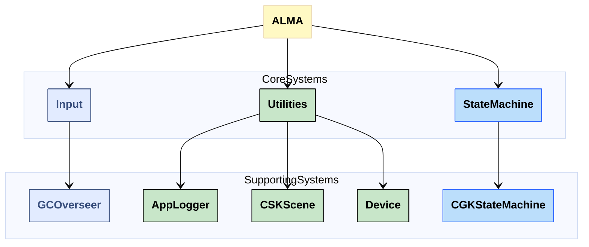

[](https://developer.apple.com/swift/)
[](https://developer.apple.com/xcode/)
[](https://developer.apple.com/documentation/xcode/swift-packages)
[](https://en.wikipedia.org/wiki/List_of_Apple_operating_systems)
[](https://en.wikipedia.org/wiki/MIT_License)
[](https://github.com/thatfactory/alma/actions/workflows/ci.yml)
[](https://github.com/thatfactory/alma/actions/workflows/release.yml)

# ALMA 👾
## Goal
To help developers in creating games for the Apple ecosystem without having to rewrite the core elements.

### Vision
The image below illustrates the project's high-level vision.  
While specific details may evolve over time, the core concept will remain.

```mermaid
---
config:
  class:
    hideEmptyMembersBox: true
  look: classic
  theme: base
---
classDiagram
direction TB
	namespace CoreSystems {
        class World {
	        Day/Night
	        Snow/Rain
	        Biomes/Vegetation
	        Physics
        }

        class Input {
	        Controllers
	        Touch
	        Voice
        }

        class Behavior {
	        Characters
	        NPCs
	        Bosses
	        AI
        }

        class Progress {
	        Save management
	        Achievements
	        Leaderboards
	        XP
        }

        class Sound {
        }

        class Utilities {
        }

        class StateMachine {
        }

	}
	namespace SupportingSystems {
        class GCOverseer {
	        GameControllerObserver
        }

        class VirtualPad {
	        VirtualGameController
        }

        class SpeechRecognizer {
	        ProvidesSpeechRecognition
        }

        class GKProxy {
	        AppleGameKitWrapper
        }

        class AppLogger {
	        AppleLoggerWrapper
        }

        class CSKScene {
	        AppleSKSceneWrapper
        }

        class Device {
	        ProvidesDeviceInfo
        }

        class PermissionChecker {
	        ManagesPermissions
        }

        class CGKStateMachine {
	        AppleGKStateWrapper
        }

	}
    class `Game 🎮` {
    }

    class ALMA {
    }

    `Game 🎮` --> ALMA
    ALMA --> World
    ALMA --> Input
    ALMA --> Behavior
    ALMA --> Progress
    ALMA --> Sound
    ALMA --> Utilities
    ALMA --> StateMachine
    Input --> GCOverseer
    Input --> VirtualPad
    Input --> SpeechRecognizer
    Progress --> GKProxy
    Utilities --> AppLogger
    Utilities --> CSKScene
    Utilities --> Device
    Utilities --> PermissionChecker
    StateMachine --> CGKStateMachine

    class `Game 🎮`:::White
	class ALMA:::Yellow
	class World:::Rose
	class Input:::Sky
	class Behavior:::Peach
	class Progress:::Ash
	class Sound:::Laranja
	class Utilities:::Green
	class StateMachine:::Blue
	class GCOverseer:::Sky
	class VirtualPad:::Sky
	class SpeechRecognizer:::Sky
	class GKProxy:::Ash
	class AppLogger:::Green
	class CSKScene:::Green
	class Device:::Green
	class PermissionChecker:::Green
	class CGKStateMachine:::Blue
	

	classDef White :,stroke:#000000,fill:#FFF9C4,color:#000000,stroke:#000000,fill:#FFF9C4,color:#000000,stroke:#000000,fill:#FFF9C4,color:#000000,stroke:#000000,fill:#FFF9C4,color:#000000,stroke:#000000,fill:#FFF9C4,color:#000000,stroke:#000000,fill:#FFF9C4,color:#000000,stroke:#000000,fill:#FFF9C4,color:#000000,stroke:#000000,fill:#FFF9C4,color:#000000,fill:#FFFFFF,color:#000000,fill:#FFFFFF,color:#000000,stroke:#000000,fill:#FFFFFF,color:#000000
	classDef Yellow :,fill:#FFF9C4,color:#000000,fill:#FFF9C4,color:#000000,fill:#FFF9C4,color:#000000,fill:#FFF9C4,color:#000000,fill:#FFF9C4,color:#000000
	classDef Rose :,stroke-width:1px,stroke-dasharray:none,stroke:#FF5978,fill:#FFDFE5,color:#8E2236
	classDef Sky :,stroke-width:1px,stroke-dasharray:none,stroke:#374D7C,fill:#E2EBFF,color:#374D7C,stroke-width:1px,stroke-dasharray:none,stroke:#374D7C,fill:#E2EBFF,color:#374D7C,stroke-width:1px,stroke-dasharray:none,stroke:#374D7C,fill:#E2EBFF,color:#374D7C,stroke-width:1px,stroke-dasharray:none,stroke:#374D7C,fill:#E2EBFF,color:#374D7C
	classDef Peach :,stroke-width:1px,stroke-dasharray:none,stroke:#FBB35A,fill:#FFEFDB,color:#8F632D
	classDef Ash :,stroke-width:1px,stroke-dasharray:none,stroke:#999999,fill:#EEEEEE,color:#000000,stroke-width:1px,stroke-dasharray:none,stroke:#999999,fill:#EEEEEE,color:#000000
	classDef Laranja :,fill:#FFE0B2,stroke:transparent,color:#000000,fill:#FFE0B2,stroke:transparent,color:#000000
	classDef Pine :,stroke-width:1px,stroke-dasharray:none,stroke:#254336,fill:#27654A,color:#FFFFFF,stroke-width:1px,stroke-dasharray:none,stroke:#254336,fill:#27654A,color:#FFFFFF,stroke-width:1px,stroke-dasharray:none,stroke:#254336,fill:#27654A,color:#FFFFFF,stroke-width:1px,stroke-dasharray:none,stroke:#254336,fill:#27654A,color:#FFFFFF,stroke-width:1px,stroke-dasharray:none,stroke:#254336,fill:#27654A,color:#FFFFFF
	classDef Blue :,fill:#BBDEFB,color:#000000,stroke:#2962FF,fill:#BBDEFB,color:#000000,stroke:#2962FF,fill:#BBDEFB,color:#000000,stroke:#2962FF,fill:#BBDEFB,color:#000000,stroke:#2962FF,fill:#BBDEFB,color:#000000,stroke:#2962FF,fill:#BBDEFB,color:#000000,stroke:#2962FF,fill:#BBDEFB,color:#000000,stroke:#2962FF,fill:#BBDEFB,color:#000000,stroke:#2962FF
	classDef Green :,stroke:#000000,fill:#C8E6C9,color:#000000,stroke:#000000,fill:#C8E6C9,color:#000000
```



### Current Relationships
Here's a snapshot of the current implementation, which lacks any interfaces for interaction (at the time being):



## Integration
### Xcode
Use Xcode's [built-in support for SPM](https://developer.apple.com/documentation/xcode/adding_package_dependencies_to_your_app).

*or...*

### Package.swift
In your `Package.swift`, add `ALMA` as a dependency:
```swift
dependencies: [
    .package(
        url: "https://github.com/thatfactory/alma",
        from: "0.1.0"
    )
]
```

Associate the dependency with your target:
```swift
targets: [
    .target(
        name: "YourTarget",
        dependencies: [
            .product(
                name: "ALMA",
                package: "alma"
            )
        ]
    )
]
```

Run: `swift build`
